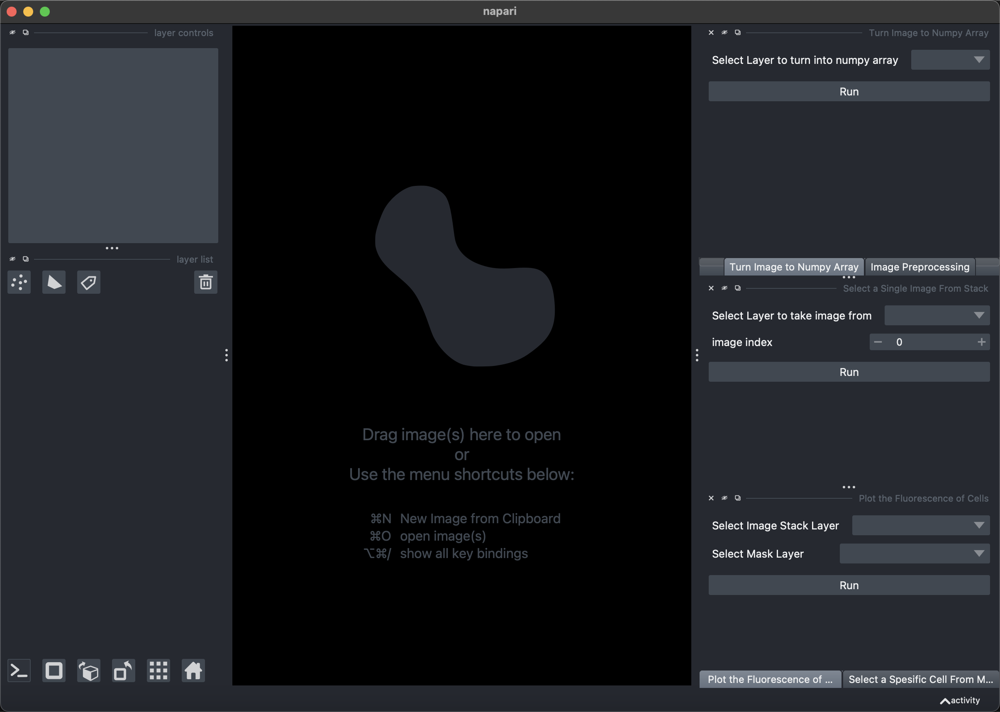
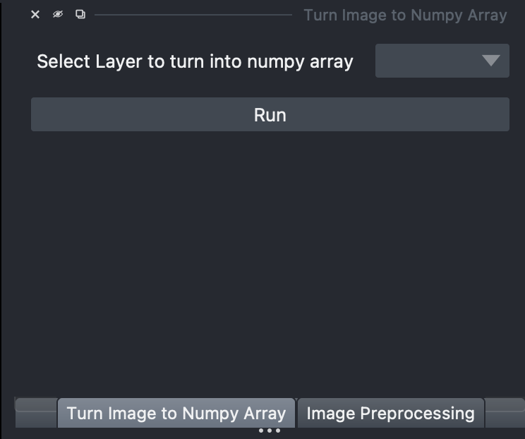
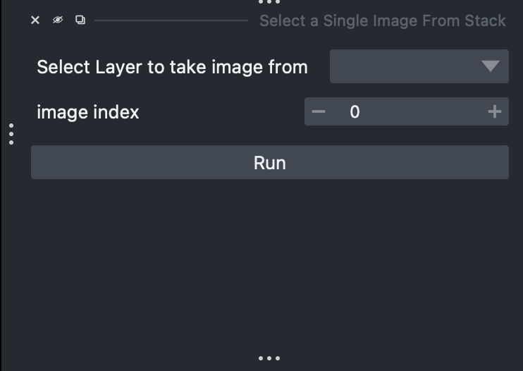
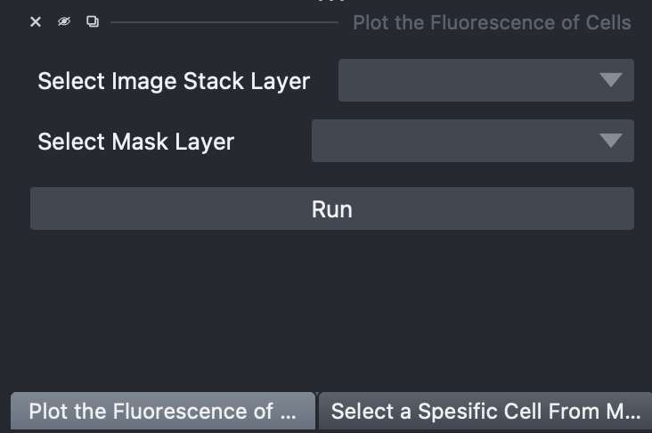

# Napari Plugin Guide

This guide provides step-by-step instructions on how to use the Napari plugin to process and analyze images in a Jupyter notebook.

[View the Repository](https://github.com/onurburakozdemir/WestmeyerLabNapari)

## Installation

1. **Setup:**
   - Head over to repository page and download the code: WLab_Napari.ipynb.
   - (Suggested) Create a new environment using conda and the napari.yml file from the repository page. See how to create a new conda environment from .yml file [here](https://conda.io/projects/conda/en/latest/user-guide/tasks/manage-environments.html).
   - Run the cells "Imports" and "Functions and Napari Window" to open napari Window.
3. **Install Required Plugins:**
   - Before starting, ensure that you have `cellpose-napari` and `pystackreg` installed.
   - Go to the Napari `Plugins` menu, search for these plugins, and install them.
   - Once the installation is complete, restart Napari to apply the changes.

## Example Pipeline for Image Analysis and Processing

2. **Launch Napari:**
   - Run the imports and Napari window section of the code in your Jupyter notebook to open Napari.

3. **Import Image Folder:**
   - Go to the top menu in Napari and select `File > Open Folder`.
   - Choose the folder containing your images.

## Optional: Organizing Image Outputs

4. **(Optional) Run Merge and Move Widgets:**
   - If you wish to use the "Merge images" and "Move images" widgets to organize images outputted by CX07, you can run the separate cell in the notebook. 
   - This step is to organize images taken from CX07 microscope and can be skipped if not needed.
   - You can close these widgets once you've completed organizing the images.

## Preparing Images for Processing

5. **Convert Images to Numpy Arrays:**
   - Select the image layer in the third widget.

   - Click the button to convert the selected image layer into a Numpy array.
   - The output will be a new layer containing the Numpy array.
## Image Processing and Analysis

6. **Use PyStackReg:**
   - From the Napari `Plugins` menu, add the PyStackReg plugin if you haven’t already done so.
   - In the PyStackReg widget, select the Numpy array layer and click on `Register and Transform`.
   - This will create a new registered layer.

7. **Apply Image Processing:**
   - Move to the Image Processing tab next to Numpy widget.
   - Select the registered Numpy array layer as input (or the Numpy layer if registration sstep was skipped).
   - Choose the desired operations and press `Run`.
   - The output will be a new processed image layer.

## Segmentation and Analysis

8. **Perform Segmentation with Cellpose:**
   - Select the processed image layer and extract a single image using the select single image widget or provide a mean image of multiple frames. Because cellpose will segment a single image to produce mask.

   - Go to the `Plugins` menu and select Cellpose.
   - It is suggested to drag the Cellpose widget to make it a floating window.
   - Select the single image layer
   - Run segmentation on the single image layer. 
   - The output will be displayed in new layers.

9. **Plot Intensity:**
   - Select the image layer you wish to analyze (e.g., Processed Image layer) in the plot fluorescence widget. This layer should contain multiple images to get fluorescence over time.

   - Choose the mask provided by Cellpose.
   - Click `Run` to generate a plot of intensities in the jupyter notebook.
   - The plot will be outputted in the Notebook, below the last executed cell.
